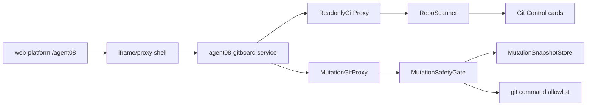

# Agent08 Git Control v1.1 SDD

Status: Audit Draft
Date: 2026-06-19
Owner: Agent08 / agent08-gitboard
Related baseline: `docs/sdd/git-status-board-v1.md`

## 1. Purpose

Agent08 v1.0.0 is a read-only Git status board. Its SDD explicitly excludes mutating Git operations, automated `push`/`commit`/branch actions, and any write into monitored repositories.

Agent08 v1.1.0 is a separate upgrade track named **Git Control**. It does not rewrite the v1.0.0 baseline. It adds an operation-capable control surface for the same split-agent repo set, with stronger safety boundaries than the read-only dashboard.

The user-facing page remains:

```text
http://127.0.0.1:3000/agent08
```

The functional owner is the independent service:

```text
/Users/tristanzh/agent/agent08-gitboard
```

The shared Web platform remains only the publishing shell/proxy/iframe host.

## 2. Version Boundary

### v1.0.0 remains unchanged

v1.0.0 remains a read-only dashboard. These v1 constraints remain valid for the v1.0.0 release line:

- no mutating Git operations;
- no automated `push`, `commit`, or branch actions;
- no write into monitored repos;
- read-only Git command allowlist only.

### v1.1.0 adds controlled mutation

v1.1.0 may execute a limited set of Git mutations, but only through `MutationGitProxy` and only after explicit safety gates pass.

Allowed v1.1 operations:

- `commit`
- `push`
- `pull --ff-only`
- `stash`
- `rebase`
- combined `stash+rebase` workflow

Forbidden v1.1 operations:

- `push --force`
- `push --force-with-lease`
- `reset --hard`
- `clean`
- `checkout` to an arbitrary ref
- `branch -D`
- `stash pop`
- shell execution not mediated by GitProxy
- any command with user-provided raw shell fragments

## 3. Seven Hard Boundaries

This section is the audit checklist. The SDD is incomplete if any item below is missing from implementation tests.

### Boundary 1: GitProxy is split into readonly and mutation layers

Agent08 v1.1 must split Git execution into two explicit boundaries:

```text
ReadonlyGitProxy
MutationGitProxy
```

`ReadonlyGitProxy` owns all v1 read commands:

- `status --porcelain=v2 --branch`
- `log`
- `diff --stat`
- `stash list`
- `ls-remote`
- remote/config reads

`MutationGitProxy` owns all v1.1 write commands:

- `add`
- `commit`
- `push`
- `pull --ff-only`
- `stash`
- `rebase`

Rules:

- Business services must not call `child_process` directly.
- UI handlers must not build Git command arrays.
- All command construction must be typed and internal to a proxy.
- Mutation proxy calls require repo id, operation id, preflight snapshot id, actor label, and confirmation token.

### Boundary 2: repo allowlist and command allowlist are mandatory

Every mutation must pass both allowlists.

Repo allowlist:

```text
agent-tooling
agent02-pvi
agent03-prs
agent04-lpm
agent05-pptx
agent06-pka
agent07-sentinel
agent08-gitboard
web-platform
```

Command allowlist:

```text
commit
push
pull_ff_only
stash
rebase
stash_rebase
```

Rules:

- repo path must resolve under the manifest path;
- path traversal must be rejected;
- unknown repo id must be rejected;
- unknown command must be rejected;
- command options must be structured booleans/enums, not raw strings;
- mutation APIs must never accept a free-form command line.

### Boundary 3: current status is rechecked immediately before mutation

The UI snapshot is not trusted as the final authority.

Before any mutation, Agent08 must rescan the target repo and compare the current snapshot against the preflight snapshot constraints required by the operation.

Operation preconditions:

| Operation | Required current state |
|---|---|
| `commit` | repo exists, on branch, has dirty files, not detached HEAD |
| `push` | repo exists, clean working tree, `ahead > 0`, `behind === 0`, upstream exists |
| `pull --ff-only` | repo exists, clean working tree, `behind > 0`, `ahead === 0`, upstream exists |
| `stash` | repo exists, dirty files exist, not detached HEAD |
| `rebase` | repo exists, clean working tree, `behind > 0`, upstream exists, no merge/rebase in progress |
| `stash+rebase` | repo exists, dirty files exist, `behind > 0`, upstream exists, no merge/rebase in progress |

Hard stops:

- dirty state blocks `pull`;
- diverged state blocks simple `push` and simple `pull`;
- detached HEAD blocks `commit`, `push`, `pull`, `rebase`, and `stash+rebase`;
- merge/rebase in progress blocks every mutation except future explicit recovery operations, which are out of v1.1 scope.

### Boundary 4: operation snapshots are stored before mutation

Before any mutation command runs, Agent08 must persist an operation snapshot under Agent08-owned storage.

Minimum snapshot fields:

```ts
interface MutationPreflightSnapshot {
  operationId: string;
  repoId: string;
  repoPath: string;
  operation: "commit" | "push" | "pull_ff_only" | "stash" | "rebase" | "stash_rebase";
  createdAt: string;
  branch: string | null;
  upstream: string | null;
  ahead: number;
  behind: number;
  dirty: {
    modified: string[];
    untracked: string[];
    deleted: string[];
    renamed: string[];
  };
  lastCommitSha: string | null;
  worktreeState: "clean" | "dirty" | "detached" | "merge_in_progress" | "rebase_in_progress" | "unknown";
}
```

Storage location:

```text
/Users/tristanzh/agent/agent08-gitboard/storage/mutations/
```

Rules:

- snapshots must be written before the mutation command starts;
- snapshot write failure blocks mutation;
- snapshots are append-only for audit;
- snapshots must not store secrets, tokens, or raw private file contents;
- snapshots may store file paths and Git metadata.

Rollback note:

v1.1 provides audit snapshots, not automatic rollback. Any rollback workflow beyond `stash` tracking is out of scope unless a later SDD defines it.

### Boundary 5: failure model is productized and operation-specific

The read-only dashboard failure model is "data unavailable" or "data stale".

The Git Control failure model is "mutation did not run", "mutation was blocked", or "mutation partially failed". Each operation must return productized error data.

Minimum error shape:

```ts
interface MutationError {
  code:
    | "REPO_NOT_ALLOWED"
    | "COMMAND_NOT_ALLOWED"
    | "SNAPSHOT_WRITE_FAILED"
    | "STALE_PREFLIGHT"
    | "DIRTY_BLOCKS_PULL"
    | "DIVERGED_BLOCKS_SIMPLE_PUSH"
    | "DIVERGED_BLOCKS_SIMPLE_PULL"
    | "DETACHED_HEAD_BLOCKS_MUTATION"
    | "MERGE_OR_REBASE_IN_PROGRESS"
    | "UPSTREAM_MISSING"
    | "COMMIT_MESSAGE_REQUIRED"
    | "CONFIRMATION_TOKEN_REQUIRED"
    | "CONFIRMATION_TOKEN_EXPIRED"
    | "CONFIRMATION_TOKEN_USED"
    | "CONFIRMATION_TOKEN_MISMATCH"
    | "GIT_COMMAND_FAILED";
  title: string;
  summary: string;
  suggestedAction: string;
  rawStderrRedacted?: string;
}
```

Rules:

- UI must show `title`, `summary`, and `suggestedAction`.
- UI must not dump raw stderr as the primary error message.
- Raw stderr, if kept, must be redacted and available only in an expandable diagnostic block.
- Tokens, remote credentials, local secrets, and private file contents must be redacted.
- The API response must distinguish "blocked before command" from "Git command failed after command start".

### Boundary 6: self-monitoring has explicit mutation semantics

`agent08-gitboard` remains in the monitor set and has no cleanliness exception.

v1.1 must explicitly label self-mutation:

- If `agent08-gitboard` is dirty, it may display `commit` if normal preconditions pass.
- If Agent08 commits itself, the running service code does not change until the service restarts or reloads.
- UI must show a self-monitoring notice before self-commit or self-push:

```text
This operation changes the agent08-gitboard repository. Running service code will not change until restart.
```

Rules:

- self-commit requires the same confirmation as every other repo;
- self-push requires clean working tree and ahead-only state;
- no special score boost or blocker waiver for self;
- self-mutation events must be marked with `selfMutation: true` in operation audit records.

### Boundary 7: web-platform only publishes, it does not mutate Git

`/Users/tristanzh/agent/web` must not execute Git mutations for Agent08.

Allowed web-platform responsibilities:

- render shared shell and sidebar;
- host `/agent08`;
- proxy or iframe the independent Agent08 service;
- pass through API responses from Agent08 service;
- inherit platform theme;
- show service unavailable state if Agent08 service is down.

Forbidden web-platform responsibilities:

- no `git add`;
- no `git commit`;
- no `git push`;
- no `git pull`;
- no `git stash`;
- no mutation safety policy implementation;
- no direct write into monitored repos.

If web-platform needs a route handler for `/agent08`, it must either:

1. proxy to Agent08 service, or
2. render an iframe shell pointed at Agent08 service.

The mutation API must live in `agent08-gitboard`, not `web-platform`.

## 4. UI Contract

### Page identity

Visible page name:

```text
Git Control
```

Keep Git terms in English:

- `commit`
- `push`
- `pull`
- `stash+rebase`
- `branch`
- `upstream`
- `ahead`
- `behind`
- `dirty`
- `clean`

Do not translate these commands into "保存", "同步", or similar product abstractions.

### Card layout

The primary view is a compact repo card matrix.

Each card must show:

- score;
- status dot;
- repo id;
- Chinese business short label where available;
- branch state;
- ahead/behind marker;
- dirty file count or `clean`;
- stash count when `stashCount > 0`;
- action buttons that are meaningful for the current state.

Example:

```text
100 ●
agent02
车辆情报
main ↑2
3 files

[commit] [push]
```

If stash entries exist, the card shows a compact stash line:

```text
stash: 2
```

### Button visibility rules

| Repo state | Buttons |
|---|---|
| clean, synced | none |
| dirty, synced | `commit` |
| clean, ahead | `push` |
| dirty, ahead | `commit`, then `push` after rescan if clean |
| clean, behind | `pull` |
| dirty, behind | `commit`, `stash+rebase` |
| diverged clean | no simple action; show blocked detail |
| diverged dirty | `commit`, then blocked detail; no simple push/pull |
| detached HEAD | no mutation buttons |
| merge/rebase in progress | no mutation buttons |

After a successful `commit`, the UI must rescan only that repo before enabling any follow-up `push`.

Rules:

- The `push` button remains disabled while the post-commit rescan is in flight.
- The UI must not infer clean state from a successful commit response alone.
- `push` unlocks only when the post-commit repo snapshot reports `dirty` empty, `ahead > 0`, `behind === 0`, and upstream exists.
- If the post-commit rescan still reports dirty files, `push` stays blocked and the card keeps the `commit` action visible.
- Even if the UI fails to block `push`, `MutationSafetyGate` must still reject dirty-state `push` through the `push` precondition in Boundary 3.

### Confirmation flows

`commit`:

- opens a compact confirmation panel;
- shows changed file list with per-file insertions `(+)` and deletions `(-)`;
- uses `git diff --stat HEAD` data from `ReadonlyGitProxy` as the summary source;
- requires a non-empty commit message;
- rejects messages containing newline-only whitespace;
- runs current-state preflight before command.

`push`:

- shows branch, upstream, and ahead count;
- requires confirmation;
- blocks if behind count changed since preflight.

`pull`:

- uses `pull --ff-only`;
- requires clean working tree;
- blocks dirty or diverged repos.

`stash+rebase`:

- requires explicit confirmation;
- displays dirty count and behind count;
- runs `stash`, `rebase`, then leaves stash recovery instructions if rebase fails;
- must not use `stash pop` in v1.1.

## 5. Service Architecture



### Components

`ReadonlyGitProxy`
: Existing read-only Git boundary, equivalent to v1 GitProxy behavior.

`MutationGitProxy`
: New mutation command boundary. It accepts typed operation requests only.

`MutationSafetyGate`
: Validates repo allowlist, command allowlist, preflight snapshot, current status, detached/merge/rebase state, and operation-specific preconditions.

`MutationSnapshotStore`
: Writes append-only audit snapshots before mutation.

`GitControlService`
: Exposes card-ready scans and mutation APIs to the UI.

`GitControl UI`
: Compact card matrix and confirmation flows.

## 6. API Contract

### Read APIs

```text
GET /api/git-control/scan
GET /api/git-control/repos/:repoId
GET /api/git-control/mutations/:operationId
```

`GET /api/git-control/repos/:repoId` returns the single-repo snapshot plus a `stashList` field:

```ts
interface RepoDetailResponse {
  snapshot: RepoSnapshot;
  stashList: Array<{
    index: number;
    selector: string;
    message: string;
    branch: string | null;
    createdAt: string | null;
  }>;
}
```

`stashList` is read-only metadata. v1.1 does not support `stash pop` or `stash apply`.

### Mutation APIs

```text
POST /api/git-control/repos/:repoId/commit
POST /api/git-control/repos/:repoId/push
POST /api/git-control/repos/:repoId/pull
POST /api/git-control/repos/:repoId/stash-rebase
```

All mutation requests must include:

```ts
interface MutationRequestBase {
  preflightSnapshotId: string;
  confirmationToken: string;
}
```

### Confirmation Token

`confirmationToken` is a real safety contract, not a placeholder.

Token lifecycle:

- The frontend creates a token only when the user opens a mutation confirmation panel.
- The token is generated with `crypto.randomUUID()`.
- The token is bound to one operation id, one repo id, one mutation type, and one `preflightSnapshotId`.
- The token expires after 60 seconds.
- The token is single-use. Any mutation request, whether it succeeds, fails, or is blocked, consumes the token.
- Reusing a token returns `CONFIRMATION_TOKEN_USED`.
- Sending an expired token returns `CONFIRMATION_TOKEN_EXPIRED`.
- Sending a token whose repo id, operation, or snapshot id does not match the request returns `CONFIRMATION_TOKEN_MISMATCH`.

SafetyGate validation order:

1. Verify token exists.
2. Verify token age is 60 seconds or less.
3. Verify token has not been consumed.
4. Verify token is bound to the request repo id.
5. Verify token is bound to the request operation.
6. Verify token is bound to the request `preflightSnapshotId`.
7. Consume the token before executing the Git mutation command.

Commit request:

```ts
interface CommitRequest extends MutationRequestBase {
  message: string;
  files?: string[];
}
```

Response:

```ts
interface MutationResponse {
  ok: boolean;
  operationId: string;
  repoId: string;
  operation: string;
  beforeSnapshotId: string;
  afterSnapshotId?: string;
  status: "blocked" | "started" | "success" | "failed";
  error?: MutationError;
}
```

## 7. Test Contract

Implementation must be TDD. The following tests must exist before production mutation code.

### Proxy tests

- `ReadonlyGitProxy` rejects mutating commands.
- `MutationGitProxy` rejects commands not in mutation allowlist.
- `MutationGitProxy` rejects raw command strings.
- Business services do not import or call `child_process`.

### Safety gate tests

- unknown repo id is blocked;
- repo path traversal is blocked;
- dirty repo blocks `pull`;
- diverged repo blocks simple `push`;
- diverged repo blocks simple `pull`;
- detached HEAD blocks all mutation buttons;
- merge/rebase in progress blocks all v1.1 mutation APIs;
- missing upstream blocks `push`, `pull`, and `stash+rebase`;
- `push --force` and `push --force-with-lease` are impossible through public API.
- missing confirmation token blocks mutation;
- expired confirmation token blocks mutation;
- reused confirmation token blocks mutation;
- token bound to a different repo id, operation, or preflight snapshot blocks mutation.

### Snapshot tests

- mutation snapshot is written before command execution;
- snapshot write failure blocks mutation;
- snapshot excludes raw file contents and secrets;
- self-mutation snapshot includes `selfMutation: true`.

### UI tests

- clean synced card shows no buttons;
- dirty synced card shows `commit`;
- clean ahead card shows `push`;
- dirty ahead card shows `commit` but `push` is disabled until rescan clean;
- successful `commit` triggers single-repo rescan before `push` can become enabled;
- clean behind card shows `pull`;
- dirty behind card shows `commit` and `stash+rebase`;
- repo card shows `stash: N` only when stash count is greater than zero;
- detached HEAD card shows no mutation buttons and shows blocked reason;
- commit confirmation requires message;
- commit confirmation shows per-file insertion and deletion counts from diff stat;
- push confirmation shows branch/upstream/ahead;
- Agent08 self-card shows running-code warning before self mutation.

### web-platform boundary tests

- web-platform `/agent08` does not import `MutationGitProxy`;
- web-platform source does not call `git commit`, `git push`, `git pull`, `git stash`, or `child_process` for Agent08 mutation;
- web-platform renders service unavailable state when Agent08 service is down;
- web-platform route remains under shared sidebar and theme inheritance.

## 8. Non-Goals

- No force push.
- No branch creation/deletion.
- No reset/clean operation.
- No conflict resolution UI.
- No automatic rollback.
- No GitHub API mutation.
- No model calls.
- No web-platform-owned Git mutation.
- No secret or credential management UI.

## 9. Audit Checklist

Before implementation starts, TZ should verify this SDD covers:

- [ ] GitProxy split into `ReadonlyGitProxy` and `MutationGitProxy`.
- [ ] Repo allowlist and command allowlist.
- [ ] Current status recheck immediately before mutation.
- [ ] Operation snapshot storage before mutation.
- [ ] Productized operation-specific failure model.
- [ ] Explicit self-monitoring mutation semantics.
- [ ] web-platform publish-only boundary.

Implementation may start only after TZ approves this SDD.
