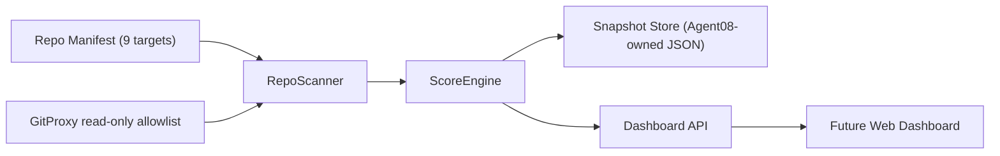

# Agent08 Git-status-board v1 SDD

## 1. Top-Level Goal

Build Agent08 as a read-only Git repository control console for TZ's split agent ecosystem. The first release aggregates 9 repositories into one local dashboard/API view so TZ can see repo health, dirty state, branch freshness, remote divergence, and release readiness without entering each repo manually.

Agent08 starts after Phase 1 repo split closure. The effective monitor set is fixed to 9 repos:

```yaml
monitor_targets:
  - agent-tooling       # governance
  - agent02-pvi         # vehicle intelligence
  - agent03-prs         # pet services
  - agent04-lpm         # local photo model
  - agent05-pptx        # PPT generation
  - agent06-pka         # personal knowledge assets
  - agent07-sentinel    # sentinel audit
  - agent08-gitboard    # self-monitoring
  - web-platform        # shared publishing surface
```

Deprecated or removed repos are excluded from v1:

- `agent06-medical`
- `agent06-webstyle`

## 2. Boundary Constraints

All Git operations are read-only. Agent08 may call:

- `git status --porcelain=v2 --branch`
- `git log`
- `git diff --stat`
- `git stash list`
- `git ls-remote`
- local filesystem reads needed to enumerate file sizes and repo paths

Agent08 must not call mutating Git commands such as `add`, `commit`, `push`, `pull`, `checkout`, `reset`, `clean`, `stash pop`, `stash apply`, `rm`, or `mv`.

Business logic must not call `exec("git ...")` directly. All Git command access goes through a `GitProxy` abstraction. This keeps command allow-listing, timeout handling, argument construction, and test doubles in one boundary.

Self-monitoring is mandatory. `agent08-gitboard` is monitored like every other repo and receives no special cleanliness, scoring, or remote-divergence exception.

Agent08 is independent from monitored repos. v1 must not modify code, config, git state, package files, generated artifacts, or working trees outside `/Users/tristanzh/agent/agent08-gitboard`.

## 3. Data Model

### Manifest

The manifest is the stable declaration of monitored repositories.

```ts
export interface RepoManifestEntry {
  id: string;
  agent: string | null;
  label: string;
  path: string;
  remote: string;
  visibility: "public" | "private" | "local";
  required: boolean;
}

export interface RepoManifest {
  version: 1;
  root: string;
  generatedAt: string;
  targets: RepoManifestEntry[];
}
```

v1 manifest target data:

| id | agent | path | remote | visibility |
|---|---|---|---|---|
| `agent-tooling` | `null` | `/Users/tristanzh/agent/agent-tooling` | `https://github.com/tristanzh-dotcom/agent-tooling.git` | `public` |
| `agent02-pvi` | `Agent02` | `/Users/tristanzh/agent/agent02-pvi` | `https://github.com/tristanzh-dotcom/agent02-pvi.git` | `public` |
| `agent03-prs` | `Agent03` | `/Users/tristanzh/agent/agent03-prs` | `https://github.com/tristanzh-dotcom/agent03-prs.git` | `public` |
| `agent04-lpm` | `Agent04` | `/Users/tristanzh/agent/agent04-lpm` | `https://github.com/tristanzh-dotcom/agent04-lpm.git` | `public` |
| `agent05-pptx` | `Agent05` | `/Users/tristanzh/agent/agent05-pptx` | `https://github.com/tristanzh-dotcom/agent05-pptx.git` | `public` |
| `agent06-pka` | `Agent06` | `/Users/tristanzh/agent/agent06-pka` | `https://github.com/tristanzh-dotcom/agent06-pka.git` | `public` |
| `agent07-sentinel` | `Agent07` | `/Users/tristanzh/agent/agent07-sentinel` | `https://github.com/tristanzh-dotcom/agent07-sentinel.git` | `public` |
| `agent08-gitboard` | `Agent08` | `/Users/tristanzh/agent/agent08-gitboard` | `https://github.com/tristanzh-dotcom/agent08-gitboard.git` | `public` |
| `web-platform` | `null` | `/Users/tristanzh/agent/web` | `https://github.com/tristanzh-dotcom/web-platform.git` | `private` |

### Snapshot

```ts
export interface RepoSnapshot {
  id: string;
  path: string;
  remote: string;
  exists: boolean;
  branch: string | null;
  upstream: string | null;
  ahead: number;
  behind: number;
  lastCommit: {
    sha: string | null;
    subject: string | null;
    authorDate: string | null;
  };
  dirty: {
    modified: string[];
    untracked: string[];
    deleted: string[];
    renamed: string[];
    stashCount: number;
    largeFiles: Array<{ path: string; bytes: number }>;
  };
  diffStat: {
    filesChanged: number;
    insertions: number;
    deletions: number;
  };
  healthScore: {
    total: number;
    cleanliness: number;
    commitFreshness: number;
    binaryRatio: number;
    conventionalCompliance: number;
    reasons: string[];
  };
}
```

### Health Score

Total score is 0-100:

- `cleanliness` 0-40: clean repo gets 40; modified/untracked/deleted/stash items reduce score by severity.
- `commitFreshness` 0-30: recent commits score highest; stale repos degrade gradually. Repos with no commits, including initial Agent08 before implementation commit, score 0 for this dimension until initialized.
- `binaryRatio` 0-20: low binary/file-size risk scores highest; large tracked or untracked binaries reduce score.
- `conventionalCompliance` 0-10: recent commit subjects matching conventional prefixes such as `feat:`, `fix:`, `docs:`, `test:`, `chore:`, `refactor:` score highest.

## 4. Functional Specification MoSCoW

### Must Have

M1: Multi-repo dashboard scan

- Load the 9-target manifest.
- For each repo, report existence, branch, upstream, last commit, and ahead/behind counts relative to remote.
- Include `agent08-gitboard` in the same scan path as all other repos.
- Treat private `web-platform` as a normal target; remote checks may fail gracefully if auth is unavailable, but local status must still report.

M2: Dirty data scan

- Report modified, untracked, deleted, and renamed files.
- Report stash count.
- Report files larger than 1 MB from the working tree scan.
- Keep ignored dependency/build directories out of large-file noise where safe: `node_modules`, `.git`, `dist`, `.venv`, `__pycache__`.

M3: Health scoring

- Compute `cleanliness(0-40)`, `commit_freshness(0-30)`, `binary_ratio(0-20)`, and `conventional_compliance(0-10)`.
- Return both component scores and explanation reasons.
- Scoring must be deterministic and testable without shelling out.

### Should Have

S1: Publishing checklist

- Summarize whether each repo is ready for publishing or follow-up.
- Flag dirty repos, diverged remotes, missing remotes, stale commits, and large binaries.
- Report `web-platform` separately as shared publishing surface.

S2: Snapshot comparison

- Persist JSON snapshots under Agent08-owned storage.
- Compare two snapshots and show repo-level deltas in dirty counts, ahead/behind, score, and last commit.

### Could Have

- Browser dashboard route in `web-platform` after API shape stabilizes.
- Per-agent drilldown panels.
- Exportable Markdown status report.

### Won't Have in v1

- Mutating Git operations.
- Automated push/commit/branch actions.
- Any write into monitored repos.
- Remote GitHub API mutation.

## 5. TDD Red-Light Contract

Every Must Have starts with at least one failing Vitest test before production code exists.

M1 red test: `tests/repoScanner.test.ts`

- Given a 9-target manifest and a fake `GitProxy`, `RepoScanner.scanAll()` returns one snapshot per target.
- The result includes `agent08-gitboard`.
- The result includes branch, upstream, last commit, and ahead/behind fields parsed from GitProxy responses.

M2 red test: `tests/dirtyScanner.test.ts`

- Given fake status, stash, diff stat, and file-size data, the scanner reports modified, untracked, stash count, and files over 1 MB.
- The test proves dirty data is gathered through `GitProxy`/scanner collaborators, not direct shell access from business logic.

M3 red test: `tests/scoreEngine.test.ts`

- Given a clean, fresh, conventional repo snapshot, `ScoreEngine.score()` returns 100 with full component scores.
- Given dirty state and a large binary, the score is lower and reasons identify cleanliness and binary penalties.

Red tests are expected to fail at Step 2.1 because `src/gitboard/*` does not exist yet. Step 2.2 will implement the minimal production code to turn these tests green.

## 6. Architecture



Component responsibilities:

- `GitProxy`: the only module allowed to execute Git commands. It accepts structured method calls and builds read-only command arguments internally.
- `RepoScanner`: orchestrates per-repo reads, parses GitProxy output, scans large files, and creates `RepoSnapshot` objects.
- `ScoreEngine`: pure scoring logic with no shell, filesystem, or network access.
- `Dashboard API`: exposes snapshots and checklist summaries after core scanner behavior is green.

## 7. Technical Stack

- TypeScript strict mode.
- Node.js ESM.
- Vitest for unit tests.
- `tsx` for local TypeScript execution if a CLI is added.
- Architecture and dependency style aligned with `agent07-sentinel`.

## 8. Verification Plan

Step 2.1:

- Create test infrastructure.
- Write red tests for M1, M2, and M3.
- Run `npm test` and confirm expected failures due missing `src/gitboard/*` implementation.

Step 2.2:

- Implement `GitProxy` interface and fake-friendly scanner contracts.
- Implement minimal `RepoScanner` and `ScoreEngine` to pass red tests.
- Run `npm test` and `npm run typecheck`.

Step 2.3:

- Add real read-only GitProxy command allowlist tests.
- Confirm no business module calls child process directly.

Step 2.4:

- Add snapshot/checklist Should Have tests and implementation only after Must Have behavior is green.
